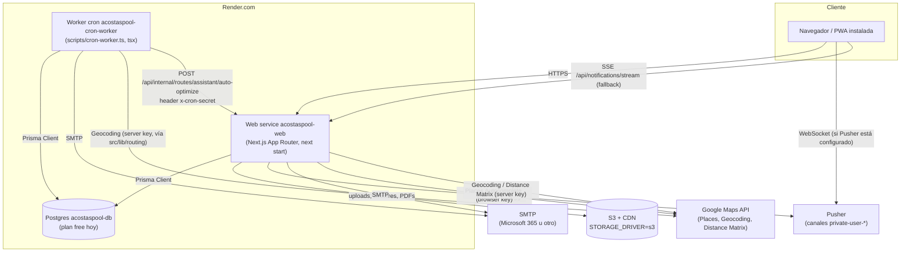

# Arquitectura

> Estado: 18 sep 2026. Rama `fix/revision-2026-09`. Toda ruta de archivo citada aquí fue
> verificada con `ls`/`grep` contra el árbol actual del repositorio.

## 1. Visión general

AcostasPool es una aplicación Next.js 16 (App Router) + TypeScript, desplegada en **Render**
(no Vercel) como dos servicios (`web` + `worker`) más una base de datos Postgres administrada,
según `render.yaml`. No es un plan a futuro: es como corre hoy.

- **Web** (`acostaspool-web`): sirve la app (páginas por rol + API routes) con `next start`.
- **Worker** (`acostaspool-cron-worker`): proceso Node independiente (`scripts/cron-worker.ts`,
  ejecutado con `tsx`) que corre las tareas periódicas (notificaciones, digests, planes
  recurrentes, asistente de rutas).
- **Postgres** (`acostaspool-db`): única fuente de datos, accedida vía Prisma 5
  (`src/lib/db.ts`) desde ambos procesos.
- **Almacenamiento**: `public/` en local, S3 + CDN en producción (`STORAGE_DRIVER=s3`).
- **Tiempo real**: Pusher con fallback a un bus SSE en memoria por instancia.
- **Correo**: SMTP genérico vía Nodemailer (Microsoft 365 u otro proveedor SMTP).
- **Mapas**: Google Maps (Places Autocomplete en el navegador, Geocoding + Distance Matrix en
  el servidor), con reintento a Nominatim/OpenStreetMap cuando no hay API key de servidor.

## 2. Diagrama de despliegue

Notas del diagrama:

- El worker **no** publica en Pusher hoy: ninguno de los módulos en `src/lib/worker/*.ts` importa
  `src/lib/notifications/realtime.ts`. Solo envía correo (`src/lib/mail/transport.ts`). Las
  variables `PUSHER_*` y `GOOGLE_MAPS_SERVER_API_KEY` están en el servicio worker de
  `render.yaml` como preparación para cuando comparta más módulos de `src/lib`; el propio
  comentario del archivo lo deja explícito.
- Sin `PUSHER_*` (servidor) configuradas, el envío en tiempo real cae a un bus en memoria
  (`src/lib/notifications/bus.ts`) que solo llega a navegadores conectados a **esa misma
  instancia** del servicio web. Con más de una instancia web, el fallback deja de ser confiable.

## 3. Estructura de carpetas

### `src/app` (por rol + API)

| Ruta | Rol / propósito |
| --- | --- |
| `src/app/page.tsx`, `about/`, `contact/`, `legal/[slug]/` | Landing pública e-info legal |
| `src/app/login/`, `reset/`, `complete-profile/`, `unauthorized/`, `offline/` | Flujo de acceso y páginas de sistema (`offline` es el fallback del Service Worker) |
| `src/app/new-integrations/[token]/` | Formulario público de aceptación/rechazo de integración (token, sin sesión) |
| `src/app/account/updates/` | Página de cuenta compartida entre roles |
| `src/app/admin/**` | `agreement-service`, `customers` (+`[id]`, `assignments`), `developer` (+`audit-log`, `tests`), `help`, `invoices` (+`[id]`), `notifications`, `reports`, `routes` (+`[id]`, `assistant`), `settings`, `technicians` (+`[id]`) |
| `src/app/tech/**` | `history`, `jobs` (+`[id]`), `profile` |
| `src/app/client/**` | `invoices`, `jobs` (+`[id]`), `profile`, `properties`, `request` |
| `src/app/manifest.ts`, `robots.ts`, `sitemap.ts` | Metadatos PWA/SEO generados |
| `src/app/layout.tsx`, `error.tsx`, `global-error.tsx`, `not-found.tsx`, `loading.tsx` | Shell raíz (fuentes, `I18nProvider`, `PwaRegister`) y páginas de error/carga |

`src/app/api/**` sigue el mismo agrupamiento por dominio: `account/` (avatar, security),
`admin/` (customers +`[id]`+`invite`, `portal-invite-targets`, `developer/customers-transfer`
+`export`/`import`, `routes/assistant` +`plan`/`settings`, `service-tiers` +`[id]`,
`settings/invoice-preview`), `auth/` (login, logout, me, forgot, reset, reset-link,
complete-profile), `client/` (availability, profile, properties, requests), `contact/quote`,
`customers/[id]/` (documents, repository +`download`/`upload`), `health/` (+`db`),
`internal/routes/assistant/auto-optimize`, `invoices/[id]/send`, `jobs/` (+`[id]/photos`,
`bulk-create`), `notifications/` (`[id]/read`, `clear`, `preferences`, `pusher-auth`, `recent`,
`stream`, `unread`), `public-integrations/response`, `reports/export`,
`routes/bulk-reschedule`, `service-agreement/pdf`.

### `src/components` (por dominio)

`account/`, `agreements/`, `billing/`, `client/`, `customers/` (+`forms/`), `dashboard/`,
`developer/`, `invoices/`, `landing/`, `layout/`, `new-integrations/`, `notifications/`, `pwa/`,
`reports/`, `routes/`, `settings/`, `tech/`, `technicians/`, `ui/`.

> `src/components/landing/**` y `src/i18n/**` los edita otro agente en paralelo; esta revisión
> solo los referencia, no los modifica.

### `src/lib` (por dominio, un módulo relevante por línea)

**`auth/`** — sesión y credenciales
| Módulo | Qué hace |
| --- | --- |
| `config.ts` | Nombre/duración de la cookie de sesión, mapa `ROLE_REDIRECTS` |
| `jwt.ts` | Firma/verifica el JWT de sesión (HS256, `jose`, expira en 7 días) |
| `session.ts` | `getSession()`: cookie → JWT → `prisma.user` (confirma `isActive`, deriva `isDeveloper`) |
| `guards.ts` | `requireAuth` / `requireRole` / `requireDeveloper` para Server Components y Server Actions |
| `password.ts` | Hash/verify con `bcryptjs` (costo 12) |
| `password-reset.ts` | Emite y envía el enlace de reseteo (token de un solo uso, 2 h) |
| `reset-token.ts` | Hash SHA-256 del token de invitación/reseteo (solo el hash se persiste) |
| `developer.ts` | Allowlist fija de emails con acceso "developer" (hoy solo `luiso.rodriguezcabrera@gmail.com`) |
| `email.ts` | `normalizeEmail` (trim + minúsculas), usado en login, alta e invitaciones |

**`config/env.ts`** — inventario único de variables de entorno, esquema Zod + reglas cruzadas
(S3, SMTP, Pusher, Google Maps, huso horario); `validateEnv()` nunca lanza, `assertEnv()` lanza
si algo bloqueante falta.

**`security/rate-limit.ts`** — `checkRateLimit` respaldado por la tabla `RateLimitBucket`
(Postgres), con fallback a un `Map` en memoria si la consulta falla.

**`storage/`**
| Módulo | Qué hace |
| --- | --- |
| `object-store.ts` | `local` (bajo `public/`) o `s3` (`@aws-sdk/client-s3`) según `STORAGE_DRIVER`; store/read/list/delete/copy/move |
| `paths.ts` | Constructores de rutas seguras (avatares, fotos de trabajo, documentos, PDFs de invoice) que rechazan segmentos `.`/`..` |

**`invoices/`**
| Módulo | Qué hace |
| --- | --- |
| `pdf.ts` | Genera el PDF de invoice: Playwright/Chromium primero, `pdf-lib` como fallback (ver §8) |
| `line-items.ts` | Normaliza/calcula el JSON `Invoice.lineItems` |
| `preview-sample.ts` | Datos de ejemplo para la vista previa de plantilla en Ajustes |
| `status-label.ts` | Traducción de `InvoiceStatus` a texto |

**`jobs/`**
| Módulo | Qué hace |
| --- | --- |
| `materialize.ts` | `materializeServicePlanJob`: crea el `Job` de una ocurrencia de `ServicePlan` (sin duplicar fecha) y encola sus notificaciones |
| `lifecycle.ts` | `applyJobLifecycleUpdate`: transacción única que actualiza el job, encola digests/notificaciones y audita |
| `scheduling.ts` | `addPlanFrequency`, `combineDateAndTime` (Luxon, huso de negocio) |
| `capacity.ts` | Slots de disponibilidad on-demand (capacidad diaria, lead time mínimo) |
| `templates.ts` | Checklist por defecto según `ServiceType` |
| `recurring-plan-templates.ts` | Catálogo de planes recurrentes "globales" predefinidos |

**`notifications/`**
| Módulo | Qué hace |
| --- | --- |
| `create.ts` | `createNotification`: crea la fila y publica en tiempo real (o difiere la publicación dentro de una `tx`) |
| `realtime.ts` | Pusher (`trigger` a `private-user-{id}`) o fallback a `bus.ts` |
| `bus.ts` | Bus SSE en memoria (por instancia) consumido por `/api/notifications/stream` |
| `preferences.ts` | Filtra por `NotificationPreference` (opt-out) contra el catálogo de `constants.ts` |
| `constants.ts` | Catálogo fijo de `eventType` permitidos por rol |
| `techDigest.ts` | Helpers de fecha de ruta (`routeDate`) y `queueTechDigestItem` |
| `tech.ts` | Helpers sobre `Notification.recipientUserId` para el rol TECH |
| `view.ts` | Título/detalle/origen localizados de una notificación para la UI |
| `client-alert.ts` | Sonido + `Notification` del navegador (con cooldown) en el cliente |

**`worker/`** (usado solo por `scripts/cron-worker.ts`)
| Módulo | Qué hace |
| --- | --- |
| `scheduler.ts` | `createTaskRunner`/`scheduleTasks`: ejecuta tareas evitando solapes, atrapa errores |
| `tasks.ts` | Arma la lista de tareas con sus cron y dependencias (`buildWorkerTasks`) |
| `constants.ts` | Expresiones cron, tamaños de lote, umbrales de reintento/orfandad |
| `customer-notifications.ts` | Envío de `Notification` de cliente por email (claim atómico + reintentos) |
| `tech-digests.ts` | Digest diario (MORNING) y de cambios (MIDDAY/EVENING) por técnico |
| `tech-digest-content.ts` | Arma las líneas de ruta/cambios de un digest |
| `recurring-plans.ts` | `processRecurringPlans`: materializa `ServicePlan` en el horizonte de 28 días |
| `route-optimize.ts` | Dispara `POST /api/internal/routes/assistant/auto-optimize` con `x-cron-secret` |
| `retry.ts` | Backoff exponencial compartido (2, 4, 8, 16 min, tope 1 h, máx. 5 intentos) |
| `email-templates.ts` | Lee `SiteSettings.emailTemplates` con caché por TTL (no usa `unstable_cache`, no aplica fuera de Next) |
| `env.ts` | `validateWorkerEnv`/`reportWorkerEnv`: igual que `config/env.ts` sin exigir `AUTH_SECRET` |
| `payload.ts`, `format.ts`, `logger.ts`, `types.ts` | Utilidades de payload JSON, formato de fecha/listas y logger con prefijo `[cron-worker]` |

**`routing/`** — asistente de rutas
| Módulo | Qué hace |
| --- | --- |
| `geo.ts` | `geocodeProperties`: reutiliza `Property.lat/lng/geocodedAt` vigentes, geocodifica el resto (Google, o Nominatim sin API key) y persiste aciertos |
| `google-api-key.ts` | Única fuente de la key de servidor (`GOOGLE_MAPS_SERVER_API_KEY`, alias `GOOGLE_MAPS_API_KEY`) |
| `address.ts` | Normaliza una dirección a su `formatted_address` de Google cuando hay key |
| `travel.ts` | Tiempo/distancia entre paradas: Google Distance Matrix o estimación por haversine |
| `job-source.ts` | Carga los `Job` elegibles para planear (estado, técnico, ventana de fecha) |
| `planner.ts` | `buildRouteAssistantPlans`: asigna y ordena paradas por técnico (estrategias `BALANCED` / `SHORT_DRIVE` / `KEEP_ASSIGNMENTS`) |

**`customers/`** — `admin-filters.ts` (where de Prisma para el listado), `delete-customer.ts`
(borrado manual de `Job`/`ServicePlan` antes de `Customer`/`User` para respetar las relaciones
`Restrict`), `format.ts` (nombre/dirección), `invite.ts` (invitación al portal), `portal-status.ts`
(estado de la invitación), `repository.ts` (rutas seguras del repositorio de documentos),
`service-payment-info.ts`, `transfer.ts` / `transfer-table.ts` (exportación/importación XLSX para
transferencia de clientes entre developers).

**`technicians/invite.ts`** — mismo patrón de invitación que `customers/invite.ts` para altas TECH.

**`audit/log.ts`** — `logAuditEvent`: sin `userId` no escribe; sin `tx` nunca lanza; con `tx`
propaga el error para que el llamador revierta la transacción.

**Configuración editable en BD (todas normalizan JSON de `SiteSettings`, ver §11 de
`DataModel.md`)**: `site-settings.ts` (fachada de lectura/escritura + `unstable_cache`),
`email-templates.ts`, `invoice-template.ts`, `landing-config.ts`, `compliance-config.ts`,
`service-agreement-content.ts` (contenido estático, no en BD) + `service-agreement-pdf.ts`
(PDF `pdf-lib`-only, independiente del de invoices).

**Utilidades de dominio compartido**: `db.ts` (cliente Prisma singleton), `timezone.ts`
(helpers Luxon sobre `BUSINESS_TIMEZONE`), `constants.ts` (catálogos `Role`/`JobStatus`/...),
`phones.ts` (normaliza a formato US), `format/currency.ts` (`Intl.NumberFormat` memoizado),
`assets.ts` (`getAssetUrl`, antepone `NEXT_PUBLIC_CDN_URL`), `public-integrations.ts` (tokens
públicos permitidos), `service-tiers.ts` (checklist por nivel de servicio, `normalizeChecklist`),
`spreadsheets/xlsx.ts` (lector/escritor XLSX propio, sin dependencia externa),
`reports/filters.ts` (rango de fechas de negocio para reportes), `utils/params.ts`
(`resolveParams`, soporta `params` síncrono o `Promise` de Next 15/16).

**`ui/`** (hooks/utilidades de cliente): `action-feedback.ts` (mensaje `?feedback=` tras un
Server Action), `body-scroll-lock.ts`, `image-compress.ts` (comprime fotos antes de subir),
`sw-update.ts` (detección de nueva versión del Service Worker), `use-escape-key.ts` /
`use-focus-trap.ts` (pila compartida de capas para modales anidados), `use-is-hydrated.ts`,
`google-maps-types.ts` (tipado mínimo de la API de Places).

## 4. Flujo de petición

1. **`src/proxy.ts`** (Next.js 16 renombró `middleware.ts` a `proxy.ts`) corre en runtime Node
   antes de cualquier render, solo para `/admin/:path*`, `/tech/:path*`, `/client/:path*`. Lee la
   cookie `ap_session` (`AUTH_COOKIE_NAME`), verifica el JWT con `verifySessionToken` y compara el
   prefijo de ruta contra `session.role`. **Nunca toca la base de datos**: es una redirección
   temprana (a `/login?next=` o `/unauthorized?next=`), no la fuente de verdad.
2. **Guards de servidor** (`src/lib/auth/guards.ts`) son la autoridad real: `requireAuth` /
   `requireRole(role)` / `requireDeveloper` llaman a `getSession()`
   (`src/lib/auth/session.ts`), que sí golpea Prisma (`prisma.user.findUnique`) para confirmar
   `isActive` y recalcular `isDeveloper`. Se invocan al inicio de cada Server Component de página
   (ej. `src/app/admin/customers/page.tsx`) **y de nuevo** dentro de cada Server Action
   (`"use server"`) del mismo archivo, porque una Server Action es un endpoint público en sí
   misma.
3. **Route Handlers** (`src/app/api/**/route.ts`) llaman `getSession()` directamente (algunos,
   como `src/app/api/health/db/route.ts`, exigen además `session.isDeveloper`). Los endpoints sin
   sesión (login, forgot/reset password, `contact/quote`, `public-integrations/response`) pasan
   primero por `checkRateLimit` (`src/lib/security/rate-limit.ts`), típicamente con dos claves
   combinadas (IP + email/cuenta).
4. **Acceso a datos**: todo pasa por el cliente Prisma singleton `src/lib/db.ts`
   (cacheado en `globalThis` fuera de producción para sobrevivir al HMR de `next dev`).

## 5. Notificaciones

- **Creación**: `src/lib/notifications/create.ts#createNotification` — fuera de una transacción
  crea la fila y publica de inmediato; dentro de una `tx` (usado por `jobs/lifecycle.ts` y
  `jobs/materialize.ts`) devuelve `{ notification, publish }` y el llamador **debe** invocar
  `publish()` después del commit. Ejemplo real: al completar un trabajo con foto obligatoria,
  `src/app/api/jobs/[id]/photos/route.ts` crea dos notificaciones `JOB_COMPLETED` (una para
  ADMIN, otra para el `Customer` dueño del trabajo).
- **Tiempo real**: `src/lib/notifications/realtime.ts#publishNotification` resuelve destinatarios
  (ADMIN → todos los admins activos salvo el actor; CUSTOMER → el `User` vinculado vía
  `Customer.userId`; TECH → `Notification.recipientUserId`) y dispara Pusher al canal
  `private-user-{userId}`, autorizado por `src/app/api/notifications/pusher-auth/route.ts`
  (solo deja autorizar el canal del propio usuario en sesión). Sin credenciales Pusher, cae a
  `broadcastNotification` (`bus.ts`), consumido por el SSE de
  `src/app/api/notifications/stream/route.ts` — server-only, no cruza instancias. El navegador
  reproduce sonido/alerta con `src/lib/notifications/client-alert.ts`.
- **Preferencias**: `NotificationPreference` (opt-out por `eventType`) filtradas por
  `src/lib/notifications/preferences.ts` contra el catálogo fijo `ROLE_NOTIFICATION_TYPES`
  (`constants.ts`).
- **Worker → email al cliente**: `src/lib/worker/customer-notifications.ts#processCustomerNotifications`
  corre cada 2 minutos sobre `Notification` (`channel=EMAIL`, `recipientRole=CUSTOMER`,
  `eventType` en `SERVICE_SCHEDULED` / `SERVICE_RESCHEDULED` / `JOB_COMPLETED`): recupera
  `PROCESSING` huérfanos (>10 min), reencola `FAILED` cuyo backoff venció, reclama un lote
  `QUEUED` con un `updateMany` atómico y solo procesa las filas que ese `updateMany` marcó. Cada
  envío pasa por `sendMailAndLog` (`src/lib/mail/transport.ts`), que **siempre** deja una fila
  `EmailLog` (SENT o FAILED).
- **Digests de técnico**: `TechDigest` (una fila por técnico/día/ventana, única) +
  `TechDigestItem` (un ítem por cambio, encolado por `queueTechDigestItem` desde
  `materialize.ts`/`lifecycle.ts`). El worker envía el plan diario (MORNING, 06:30) y los
  digests de cambios (MIDDAY 12:00 / EVENING 21:00), reclamando la fila para no duplicar envíos
  y reintentando `FAILED`/`PROCESSING` huérfanos cada 2 minutos (`retryFailedDigests`).

## 6. Planes recurrentes y materialización

`ServicePlan` (frecuencia `WEEKLY`/`BIWEEKLY`/`MONTHLY`, `nextRunAt`) se convierte en `Job`
mediante `src/lib/jobs/materialize.ts#materializeServicePlanJob(db, plan, { now, scheduledDate?,
advancePlan? })`. Nunca escribe si: el plan está inactivo, la fecha resultante es inválida, el
cliente está inactivo o pausado para esa fecha (`Customer.estadoCuenta` / `pauseServicesFrom`), o
ya existe un `Job` con ese `(planId, scheduledDate)` — la deduplicación es por diseño, no por un
índice único. Resuelve el nivel de servicio (`ServiceTier` del plan o el primero activo),
normaliza su checklist, calcula `sortOrder` a partir de la hora en `BUSINESS_TIMEZONE`, y marca el
job `PENDING` (si es hoy) o `SCHEDULED`, con la nota `[Auto generated recurring job]`.

Dos llamadores:

1. Las pantallas de cliente/propiedad materializan **una** ocurrencia (la próxima) con
   `advancePlan: true`.
2. El worker (`src/lib/worker/recurring-plans.ts#processRecurringPlans`, cada 10 minutos y una
   vez al arrancar desde `scripts/cron-worker.ts`) expande **todos** los planes activos en un
   horizonte de 28 días (`RECURRING_LOOKAHEAD_DAYS`), avanzando fecha a fecha hasta el fin del
   horizonte o la pausa del cliente, y deja `nextRunAt` apuntando a la primera ocurrencia fuera
   del horizonte.

Tras cada materialización, `queueJobScheduledNotifications(job)` encola un `TechDigestItem`
(`ROUTE_ASSIGNED`/`JOB_ASSIGNED`) para el técnico y una `Notification` `SERVICE_SCHEDULED` para
el cliente.

## 7. Asistente de rutas

- **Coordenadas persistidas**: `Property.lat` / `lng` / `geocodedAt` (migración
  `20260917000211_property_geocode`). `src/lib/routing/geo.ts#geocodeProperties` reutiliza
  coordenadas de menos de 365 días (`PERSISTED_COORDINATES_MAX_AGE_MS`); solo geocodifica lo que
  falta, vía Google Geocoding (`GOOGLE_MAPS_SERVER_API_KEY`) con **fallback a Nominatim/OpenStreetMap**
  si no hay key de servidor, con caché en memoria acotada (2000 entradas, TTL 24 h en éxito / 5
  min en fallo) y persistencia best-effort de los aciertos.
- **Tiempos de viaje**: `src/lib/routing/travel.ts` usa Google Distance Matrix si hay key, o una
  estimación por distancia haversine si no, siempre con concurrencia acotada
  (`mapWithConcurrency`).
- **Planificador**: `src/lib/routing/planner.ts#buildRouteAssistantPlans` asigna cada trabajo
  elegible (`job-source.ts`) a un técnico y ordena sus paradas bajo una de tres estrategias
  (`BALANCED`, `SHORT_DRIVE`, `KEEP_ASSIGNMENTS`); el admin revisa el plan en
  `/admin/routes/assistant` antes de aplicarlo (`POST /api/admin/routes/assistant/plan`).
- **Automatización diaria**: `SiteSettings.routeAssistantConfig.dailyAutoOptimizeEnabled`
  habilita la tarea del worker a las 07:00 (`src/lib/worker/route-optimize.ts`), que llama
  `POST /api/internal/routes/assistant/auto-optimize` con cabecera `x-cron-secret` (rechazada sin
  `CRON_SECRET`); usa `redirect: "manual"` y trata cualquier 3xx como fallo — la señal típica de
  que `APP_URL`/`CRON_SECRET` están mal y la llamada terminó en `/login`.

## 8. Almacenamiento y PDFs

`STORAGE_DRIVER` (`local` por defecto, o `s3`) selecciona el backend en
`src/lib/storage/object-store.ts`. En `local` los archivos quedan bajo `public/` — **una sola
instancia**, el filesystem de Render es efímero y no se comparte entre procesos ni sobrevive un
redeploy. En `s3` se usa `@aws-sdk/client-s3` y se sirve por `NEXT_PUBLIC_CDN_URL` o la URL del
bucket. `src/lib/storage/paths.ts` construye todas las rutas (avatares, fotos de trabajo,
documentos de cliente, PDFs de invoice bajo `invoices/YYYY/MM/<cliente>/<invoice>.pdf`)
rechazando segmentos `.`/`..`.

**PDF de invoice** (`src/lib/invoices/pdf.ts#generateInvoicePdfBytes`): renderiza la plantilla
HTML configurable (`src/lib/invoice-template.ts`, con textos editables en
`SiteSettings.invoiceTemplate`) con **Chromium headless vía Playwright** (`page.pdf()`, A4,
fondo impreso). Si Playwright/Chromium no está disponible (falla el `import`, falta
`npx playwright install chromium`), el `catch` cae a `generateInvoicePdfWithPdfLibBytes`, que
redibuja el mismo invoice con primitivas de **`pdf-lib`** (fuentes, rectángulos, marca de agua
para el tema `ESTIMATE`). Ambos caminos terminan en `storePublicAsset`.

Un segundo generador, **independiente**, no comparte código con el anterior:
`src/lib/service-agreement-pdf.ts#buildServiceAgreementPdfBytes` (servido por
`/api/service-agreement/pdf`) es **solo `pdf-lib`**, sobre contenido estático de
`src/lib/service-agreement-content.ts`; nunca usa Playwright.

## 9. Internacionalización (i18n)

`src/i18n/config.ts` fija los locales soportados (`en`, `es`; por defecto `en`) y la cookie
`ap_locale`. `src/i18n/messages/{en,es}.json` son los diccionarios; `src/i18n/translate.ts`
resuelve claves por ruta de puntos, interpola `{{token}}` y soporta plural (`t.plural(key, count,
values)` con formas `.one`/`.other`). `src/i18n/server.ts#getTranslations` lee la cookie en
Server Components; `src/i18n/client.tsx#I18nProvider`/`useI18n` exponen el mismo traductor a los
Client Components vía Context. Pruebas dedicadas en `tests/unit/i18n/` (paridad de claves
en/es, plural, formato de moneda, etiquetas de estado de invoice).

> `src/i18n/**` lo edita otro agente en paralelo con este trabajo; aquí solo se documenta.

## 10. PWA

`src/app/manifest.ts` genera el manifest (`start_url: /login`, `display: standalone`, iconos en
`public/pwa/`). `public/sw.js` (versión de caché `acostaspool-static-v2`) precachea la página
`/offline` y los iconos PWA, sirve `/_next/static/**`, `/pwa/**` y el favicon con estrategia
cache-first, y en navegaciones intenta red y cae a `/offline` sin conexión; llama
`skipWaiting()`/`clients.claim()` y avisa a las pestañas abiertas con `postMessage`
(`SW_UPDATED`). `src/components/pwa/PwaRegister.tsx` registra el SW y programa chequeos de
actualización (`src/lib/ui/sw-update.ts`); `PwaUpdateNotice.tsx` muestra el aviso "nueva versión
disponible" (localizado desde `<html lang>`, fuera del `I18nProvider`); `InstallAppAction.tsx`
captura `beforeinstallprompt` para el botón de instalación manual.

## 11. Seguridad

- **Sesión**: JWT (HS256, `jose`) en la cookie httpOnly `ap_session` (`AUTH_COOKIE_NAME`,
  7 días), payload `{ sub, email, name, role, avatarUrl }`, firmado con `AUTH_SECRET`
  (`src/lib/auth/jwt.ts`). Verificar la firma no requiere BD, pero cada guard de servidor vuelve a
  leer `User` (`getSession()`) para confirmar `isActive` y recalcular `isDeveloper` — la cookie
  por sí sola no basta para autorizar.
- **Roles**: enum Prisma `Role` (`ADMIN`/`TECH`/`CUSTOMER`). Un flag oculto `User.isDeveloper`,
  combinado con una allowlist fija de emails (`src/lib/auth/developer.ts`, hoy solo
  `luiso.rodriguezcabrera@gmail.com`), eleva el rol efectivo a ADMIN y desbloquea
  `/admin/developer/*`.
- **Contraseñas**: `bcryptjs` costo 12 (`src/lib/auth/password.ts`). Tokens de invitación/reseteo:
  32 bytes aleatorios, solo se persiste el **hash SHA-256** (`PasswordResetToken.token`), con
  `purpose` (`INVITE`/`PASSWORD_RESET`) y expiración (2 h para reseteo).
- **Rate limiting**: `src/lib/security/rate-limit.ts#checkRateLimit`, respaldado por
  `RateLimitBucket` (Postgres) con fallback a un `Map` en memoria si la consulta falla. Aplicado
  hoy en `api/auth/login`, `api/auth/forgot`, `api/auth/reset`, `api/auth/reset-link`,
  `api/contact/quote` y `api/public-integrations/response` (varios con doble clave IP + email).
- **Validación de entorno**: `src/lib/config/env.ts` (esquema Zod + reglas cruzadas para S3,
  SMTP, Pusher, Google Maps y huso horario). Se ejecuta al arrancar desde
  `src/instrumentation.ts` (`register()`, solo runtime Node; Next la omite en `next build`, así
  que nunca rompe el build) y, con variables propias, desde `src/lib/worker/env.ts` (excluye
  `AUTH_SECRET`, que el worker no usa). Solo con `NODE_ENV=production` un problema bloqueante
  aborta el arranque; en cualquier otro caso queda como advertencia `[env]` en logs.
- **Protección de rutas en dos capas**: `src/proxy.ts` (cookie-only, redirección temprana) +
  `src/lib/auth/guards.ts` (con BD, autoridad real) — ver §4.

## 12. Despliegue en Render, paso a paso

`render.yaml` es la fuente única: 2 servicios (`acostaspool-web`, `acostaspool-cron-worker`) + 1
base de datos (`acostaspool-db`).

1. **Crear los recursos**: apuntar un Blueprint de Render a este repo (detecta `render.yaml`) o
   crear los tres recursos manualmente con los mismos nombres.
2. **Variables por servicio** (las que `render.yaml` marca `sync: false` se cargan a mano desde
   el dashboard; ver la tabla completa de uso en `.env.example`):
   - **Web**: `AUTH_SECRET`, `NEXT_PUBLIC_CDN_URL` + 4 `AWS_*` (si `STORAGE_DRIVER=s3`),
     `NEXT_PUBLIC_GOOGLE_MAPS_API_KEY`, `GOOGLE_MAPS_SERVER_API_KEY`, 5 `SMTP_*` +
     `CONTACT_INBOX_EMAIL`, `CRON_SECRET`, 4 `PUSHER_*` (servidor) + 2 `NEXT_PUBLIC_PUSHER_*`
     (cliente, se incrustan en el build). `DATABASE_URL` la inyecta la base de datos; `APP_URL` y
     `STORAGE_DRIVER` ya están fijadas en `render.yaml`.
   - **Worker**: `SMTP_*` + `CONTACT_INBOX_EMAIL`, `CRON_SECRET`, `PUSHER_*` (servidor),
     `GOOGLE_MAPS_SERVER_API_KEY` — estas dos últimas no las lee hoy `scripts/cron-worker.ts`
     directamente (ver nota del diagrama en §2), pero conviene mantenerlas sincronizadas con el
     servicio web.
3. **Build**: el servicio web instala dependencias de dev, genera el cliente Prisma e instala
   Chromium (`npx playwright install chromium`) antes de `next build`; el worker omite Chromium
   (`PLAYWRIGHT_SKIP_BROWSER_DOWNLOAD=1`) porque no genera PDFs.
4. **Migraciones**: `preDeployCommand` reintenta `npx prisma migrate deploy` hasta 3 veces (5 s
   entre intentos) antes de arrancar cada servicio.
5. **Riesgo real de la migración `20260917000426_timestamptz`**: convierte **todas** las columnas
   `DateTime` (~20 tablas) a `TIMESTAMPTZ(3)` con `ALTER COLUMN ... TYPE ... USING col AT TIME
   ZONE 'UTC'`. Postgres ejecuta ese `ALTER` como una **reescritura de tabla bajo `ACCESS
   EXCLUSIVE LOCK`**: bloquea lecturas y escrituras de cada tabla mientras dura. Con los volúmenes
   actuales es rápido, pero:
   - El plan `free` de `acostaspool-db` **no tiene backups ni point-in-time recovery**
     (comentario explícito en `render.yaml`) — antes de un deploy con migraciones de este tipo,
     tomar un snapshot manual (`pg_dump`) es la única red de seguridad real.
   - Desplegar en ventana de bajo tráfico: mientras dura el lock, cualquier petición que toque
     esa tabla (incluida `GET /api/health/db`) queda en espera.
   - Migraciones de datos de la misma tanda (`20260917000011_tech_digest_unique`,
     `20260917000600_normalize_emails`) están escritas para ser **idempotentes** (deduplican o
     normalizan solo lo que aún no está en su forma final) — el patrón a seguir en migraciones
     futuras (ver ADR 0008).
6. **Verificación post-deploy**: `GET /api/health` (liveness, sin sesión, es el
   `healthCheckPath` de Render) y `GET /api/health/db` (requiere sesión ADMIN + `isDeveloper`,
   corre `SELECT 1`). En los logs del servicio web, líneas `[env]` avisan de integraciones sin
   configurar (o abortan el arranque si `NODE_ENV=production` y falta algo obligatorio). En el
   worker, al arrancar se listan las tareas programadas (`scheduled <tarea> (<cron>)`); después
   solo se registran los ticks con actividad y los errores.

## 13. Verificación (local y CI)

**Scripts npm** (`package.json`): `npm run dev` / `build` / `start`; `worker:cron` (`-- --once`
ejecuta cada tarea una vez y sale); `lint`; `typecheck`; `db:generate` / `db:migrate` /
`db:studio` / `db:seed` / `db:create-admin` / `db:create-developer` /
`db:backfill-notifications`; `test` / `test:unit` (Vitest) / `test:watch`; `test:e2e`
(Playwright); `verify` = `typecheck && lint && test:unit`.

**CI** (`.github/workflows/ci.yml`, en cada push a `main` y en cada PR): levanta un contenedor
`postgres:16` como servicio, corre `prisma generate` + `prisma validate`, `typecheck`, `lint`,
`test:unit`, luego `prisma migrate deploy` + `db:seed` contra ese Postgres, `next build`,
instala Chromium (`playwright install --with-deps chromium`) y corre `test:e2e`; sube
`test-results/` como artefacto si algo falla.

**E2E con Postgres local**: `playwright.config.ts` arranca `next start` él mismo cuando
`CI=true` (y espera `${baseURL}/api/health`); en local usa `npm run dev` si no hay un servidor ya
corriendo (`reuseExistingServer: true`). Para reproducir el flujo de CI en una máquina local:
levantar un Postgres 16 (Docker o nativo), apuntar `DATABASE_URL` a él, correr
`npx prisma migrate deploy` y `npm run db:seed`, y luego `npm run test:e2e` (usa las cuentas
`SEED_*` de `.env`/`.env.example`). Las pruebas E2E están en `tests/e2e/` (`auth`, `admin`, `tech`,
`client`, `public`, `api`, más `helpers/` para fixtures y aserciones comunes); las unitarias en
`tests/unit/` agrupadas por dominio (`customers`, `jobs`, `worker`, `routing`, `notifications`,
`templates`, `i18n`, `config`, `mail`, `ui`, `utils`, `api`).
